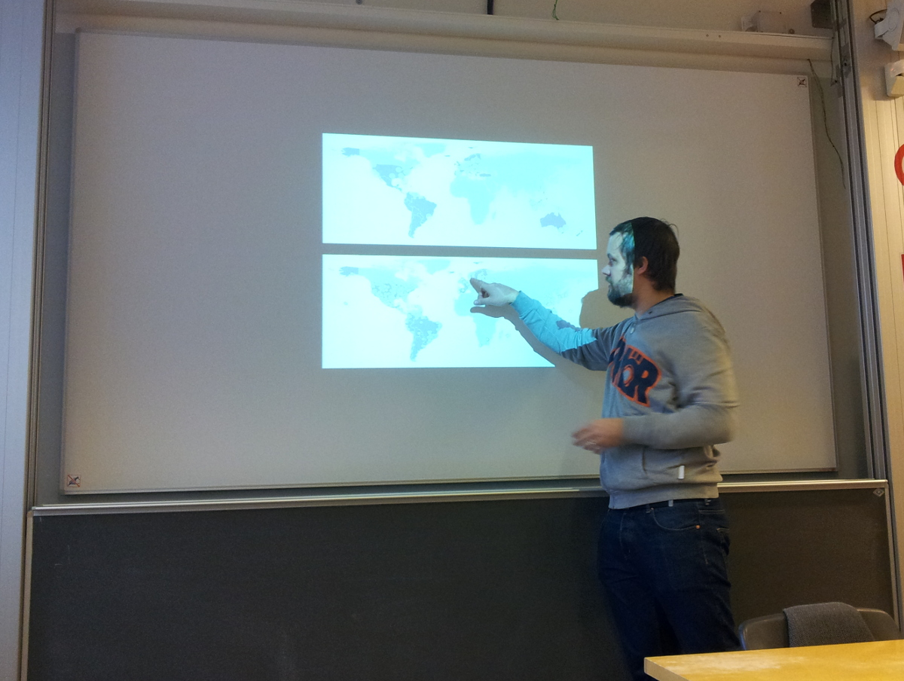
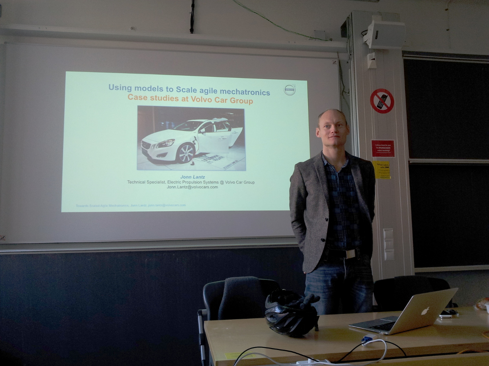
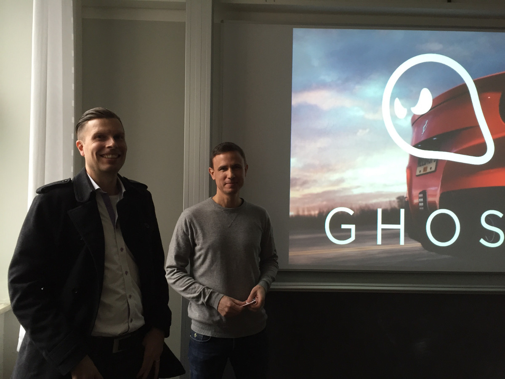

  

# Computing Lab Tech Talks

We will hold a series of technical seminars over lunch on Mondays from Jan 26 to March 9 in 2015. They are open to anyone interested: students, practitioners and researchers are welcome! The focus of the seminars will be on interesting challenges in industry.

Lunch baguettes will be served for the early-comers.

Along with the seminars, students will also be offered a [course on academic writing](http://www.cse.chalmers.se/~laurako/links/CCTT.html) related to the seminars.

The tech talks are sponsored by the [ICT Area of Advance](http://www.chalmers.se/en/areas-of-advance/ict/Pages/default.aspx).

\

## Extra tech talk

There will be an extra tech talk in study period 4 by Russell Brown (Basho Technologies) about Basho and the Riak database.

>| *<u>Title</u>: [CRDT sets from paper to product](abstracts.html#brown)*
>| *<u>Time</u>: Wednesday, May 27, 15.15 - 16.15*
>| *<u>Place</u>: [Room EC, D&IT building, Chalmers Johanneberg](http://maps.chalmers.se/#ec631799-6bfa-4995-95e3-efe03c13ad70)*
>| [Slides](tech-talks/brown_basho.pdf)

\

## Schedule

                           Day  Speaker                        Topic
------------------------------  -------                        ----
                      **26/1**  Niklas Gustavsson (Spotify)    [Optimizing Audio Content Delivery at Scale](abstracts.html#gustavsson)
                       **2/2**  Andreas Olofsson (Adapteva)    [Designing the Epiphany Parallel Processor: Standing on the Shoulders of Giants with Blinders in Place](abstracts.html#olofsson)
                       **9/2**  Anders Åhlander (Saab)         [Embedded High-Performance Processing -- Challenges in Long-Lifetime Applications](abstracts.html#ahlander)
                      **16/2**  Angela Wallenburg (Altran UK)  [Safe and Secure Programming Using SPARK](abstracts.html#wallenburg)
                      **23/2**  Andreas Brinck (EA Ghost)      [Real Time Deformation in Need for Speed™](abstracts.html#brinck)
**3/3**  Jonn Lantz (Volvo Cars)        [Model Driven Development in Automotive Mechatronics](abstracts.html#lantz)
                       **9/3**  John Hughes (QuviQ)            [Testing the Hard Stuff](abstracts.html#hughes)

Each presentation will be held from 12.00 to 13.00 in [room EC, D&IT building, Chalmers Johanneberg](http://maps.chalmers.se/#ec631799-6bfa-4995-95e3-efe03c13ad70).

There is also an associated [calendar for the talks](https://www.google.com/calendar/embed?src=vk6mn4kquejl2d5hhus4bpkg2c%40group.calendar.google.com&ctz=Europe/Stockholm).

\

  

  
  &nbsp;
  
  &nbsp;
  
  &nbsp;
  

  

[*](attendance.html)
  

